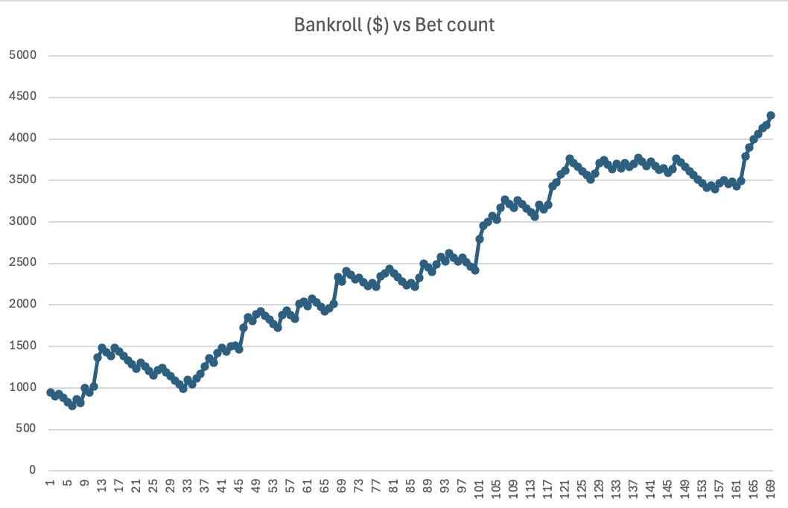

# Valorant Match Predictor

## Overview
A machine learning-driven predictor designed to estimate the outcomes of Valorant matches by leveraging historical data, team statistics, and advanced predictive modeling techniques. This project uses a combination of GBMs and statistical analysis to model match outcomes, map selections, and profit potential through simulated betting strategies.

## Table of Contents
1. [Project Objectives](#project-objectives)
2. [Methodology](#methodology)
   - [Data Gathering](#data-gathering)
   - [Data Processing](#data-processing)
   - [Modeling](#modeling)
   - [Results and Simulations](#results-and-simulations)
3. [Installation and Setup](#installation-and-setup)
4. [Future Improvements](#future-improvements)
5. [Contributions](#contributions)

## Project Objectives
The primary goal of this project is to develop a predictive model for Valorant matches, utilizing a data-driven approach to estimate match outcomes, predict map selections, and assess the profitability of simulated betting strategies.

## Methodology

### Data Gathering
- **League Selection**: Data was gathered from top-tier Valorant leagues, including franchised (Tier 1) and challengers leagues (Tier 2) worldwide.
- **Statistics Collection**: Basic game stats were scraped for each match due to limited advanced metrics availability. This ensures broad coverage across diverse leagues.
- **Data Limitations**: Advanced stats became available in franchised leagues only in 2023 and in Chinese leagues in 2024. This limitation required focusing on fundamental stats across all leagues.

### Data Processing
- **Match Format Analysis**: Valorant matches follow various formats, such as Best of 1, Best of 3, or Best of 5, with teams selecting and banning maps for each match.
- **Statistical Transformation**: Raw stats were converted into more descriptive metrics (e.g., kills per round) to improve model interpretability.
- **Map Playrate Calculation**: Playrates of each map were calculated based on historical data, giving insight into map preferences for each team.
- **Elo Rating System**: An Elo rating system was implemented to give a general measure of each team’s relative strength.
- **Parameter selection**: Through experimentation, it was found that more complex parameters and statistics proved too unreliable, and sticking to a few, simpler datapoints produced much more reliable results

### Modeling
- **Map Selection Prediction**: A GBM model was trained on map pick/ban data to predict likely maps while allowing for minor prediction inaccuracies.
- **Winrate Prediction**: Another GBM was developed to predict win rates on specific maps, using calculated advanced stats and team deltas.
- **Winshares Calculation**: Winshares were computed by multiplying the win probability for each map by its likelihood of being picked.
- **Series Outcome Prediction**: The overall match winrate was calculated based on winshare ratios and adjusted Elo ratings using a final GBM model.
- **Model Optimization**: Grid parameter search was employed to optimize each GBM for accuracy.

### Results and Simulations
- **Leagues**: Only the tier 1 leagues were predictable enough to reliably bet on, this is likely due to the lower level of tactics and strategy below the tier 1 level, resulting in much more form-based and unpredictable matchups, as well as map strength being less of a factor.
- **Simulation Timeframe**: Models were trained on data from 2022 to early 2024, with simulations run on the 2024 season's remaining data.
- **Betting Strategy**: A simulated betting approach was tested with a starting bankroll of $1000, betting 5% per profitable match.
- **Simulated Outcomes**:
   - **Average Odds**: Simulations using average odds produced an EV of ~1.2, yielding a profit range of $1000-$2000 for the 2024 season.
   - **Max/Min Odds**: Higher EV of ~1.4 with a profit range of $2000-$3000 over the 2024 season.
   - **Comments**: Regardless of the method of odds used, it is clear that esports betting websites heavily favour the favourite; the model heavily favoured bets on the underdog, with 72% of bets placed on underdogs in the Average Odds simulation, and 76% placed on underdogs in the Min/Max Odds simulation.
   

### Prerequisites
- Ensure Python 3.x is installed on your system.
- pip install requirements.txt

## Future Improvements
- Integration of advanced metrics as they become available across leagues.
- Improved map selection model to account for new/cycled maps with low data availability.
- Improved elo system to make bets on tier 2 matches profitable.

## Contributions
- All match stats and data sourced from https://www.vlr.gg/
- Game data such as agents, map pool, and maps sourced from https://valorant.fandom.com/wiki/VALORANT_Wiki

